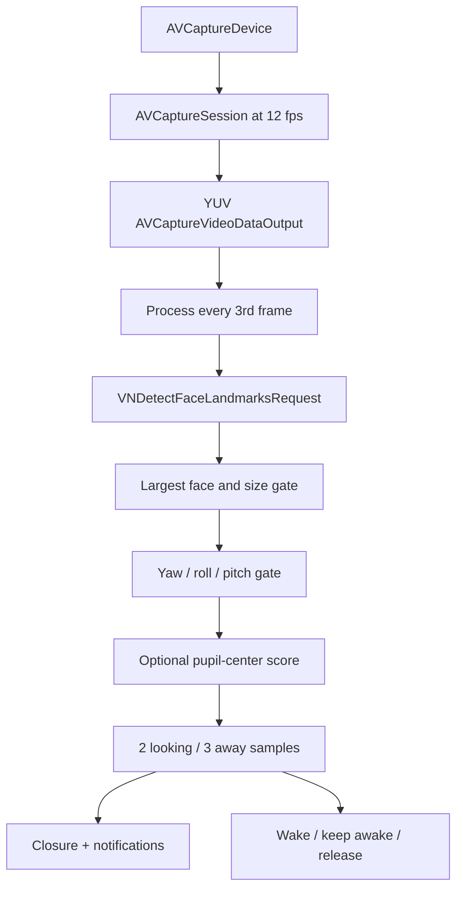

# Architecture

## Overview

GazeAwake is a small native macOS agent composed of four source files:

- `main.swift`: starts `NSApplication` without a document/window lifecycle.
- `AppDelegate.swift`: menu bar UI, wake preference, callbacks, and IOKit assertions.
- `CameraManager.swift`: permission flow, AVFoundation configuration, serial capture scheduling, and frame throttling.
- `GazeDetector.swift`: Vision request, attention heuristic, debounce, and notifications.

## Capture pipeline

The app prefers these session presets in order:

1. 320×240 (`qvga320x240`)
2. 352×288 (`cif352x288`)
3. 640×480 (`vga640x480`)
4. `.low`

The device is limited to 12 fps when its active format supports that rate. Output uses bi-planar 4:2:0 YUV. Late frames are discarded. Session control and sample-buffer processing share one utility serial queue, preventing overlapping Vision requests and avoiding an extra worker stack.

Every third frame is processed, producing roughly four Vision requests per second. Each callback is wrapped in `autoreleasepool`; no sample buffer or image buffer is cached or dispatched to another queue.

## Attention heuristic

`VNDetectFaceLandmarksRequestRevision3` is reused across frames. `VNImageRequestHandler` exists only for the current frame.

1. Choose the largest face.
2. Reject it when normalized face area is below `0.018` (1.8% of the frame).
3. Reject when available pose values exceed:
   - `abs(yaw) > 0.48` rad (~27.5°)
   - `abs(roll) > 0.58` rad (~33.2°)
   - `abs(pitch) > 0.55` rad (~31.5°)
4. If both eye regions and pupils are available, compute each pupil centroid inside the eye bounding rectangle.
5. Score horizontal centeredness at 75% and vertical centeredness at 25%.
6. Require both eyes to score at least `0.28`.

If landmarks, eye regions, or pupils are unavailable after the face and pose gates pass, the current v0.1 implementation returns `true`. This deliberate fallback improves low-resolution availability but means the result may degrade to **face present and roughly facing the display**.

## Debounce

At approximately four evaluated frames per second:

- 2 consecutive positive samples confirm looking (~0.5 seconds).
- 3 consecutive negative samples confirm away (~0.75 seconds).

Only confirmed state changes are emitted.

## State output

- Closure: `onStateChanged: ((Bool) -> Void)?`
- Local notification: `GazeAwakeStateDidChange`
- Distributed notification: `net.xgxgx.GazeAwake.stateDidChange`
- Payload: `isLookingAtScreen: Bool`

## Power behavior

On confirmed attention:

1. `IOPMAssertionDeclareUserActivity` wakes the display and resets idle time.
2. `IOPMAssertionCreateWithName` creates a `PreventUserIdleDisplaySleep` assertion.

Both assertion IDs live exclusively on a utility power queue. They are released when attention becomes false, detection stops, wake behavior is disabled, or the application terminates.

## Threading and ownership

- AppKit and callback UI updates: main queue.
- Capture session and Vision: one utility serial queue.
- IOKit calls and assertion IDs: one utility serial queue.
- Sample buffers: borrowed only for the synchronous capture callback.

This structure prioritizes simple ownership and bounded frame concurrency. It does not control Vision's internal model and neural resource caching.
